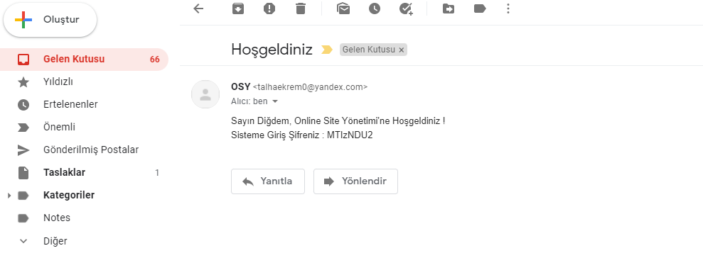

# ONLÝNE SÝTE YÖNETÝMÝ (OSY)

* Online Site Yönetimi projesi, bir sitenin yöneticilerinin ve daire sakinlerinin buluþtuðu ortak bir platformdur. 

  * Bu projede; Ýlk önce bir yönetici atanýr. Ve yönetici, yönetimini üstlendiði sitenin blok, daire, daire sakini bilgilerini girer.
  * Daire sakini sisteme kayýt aþamasýnda isim, soyisim, email ve tc bilgisi girer.
  * Ve arka tarafta, yöneticinin veritabanýna girdiði daire sakini bilgisi ile kayýt olan daire sakini bilgisi eþleþiyorsa; daire sakininin mailine otomatik þifre atanýr.
	Ve bunun bilgisi daire sakinine verilir. Artýk kullanýcý maili ve þifresiyle sisteme giriþ yapabilir.
  * Mail gönderimi; veritabanýnda daire sakini tablosunda hoþgeldiniz maili bilgisine bakýlarak her dk kontrol edilip gönderilmeyen maillere hangfire ile saðlanýr.
	(Mail gönderim iþlemim, yandexte açtýðým hesabýmýn yetki yetersizliðinden kaynaklý gerçekleþmedi. Eðitimdeki baþka bir arkadaþýmýn ayný þekilde oluþturduðu mail hesabý
	ile saðlandý, örnek görsel aþaðýya eklendi)

	 
	

	 

  * JWT token yapýsý ile authorization saðlanmýþtýr.
  * Yönetici, site yönetimine gelen faturayý, elektrik, su ve doðalgaz olarak topluca daire yansýtabilir. Bunun yapýsýný ise örneklendirerek açýklayacak olursam; Mesela aylýk 
	3000 TL elektrik faturasý geldi siteye. Toplam daire sayýsý da 30 adet. Gelen toplam tutarý toplam daire sayýsýna bölünerek daire baþýna düþen elektrik faturasý 100 TL olarak
	otomatik hesaplanýr. Yönetici; fatura türünü, toplam tutarý, tarih bilgisini ve ödeme bilgisini girer ve tüm daireler için elektrik faturasý topluca atanýr.
  * Aidat da bir fatura türüdür fakat hesaplamasý daire türlerine göre deðiþken olarak hesaplanýr. Yine örneklendirecek olursam; Sitede 30 daire var. 10 tanesi 2+1, 10 tanesi 3+1,
	10 tanesi 4+1 olsun. Yýlbaþýnda toplam ödenecek aidat ücreti belirlenmiþtir. Yönetici toplam tutarý girer. Toplam aidat tutarý 12 ye bölünerek, sitenin ödemesi gereken aylýk
	tutar bulunur. Aylýk tutar da, toplam daire sayýsýna bölünerek daire baþýna aylýk ödenecek aidat tutarý bulunur. 3+1'lere bulunan daire baþýna aylýk aidat tutarý, 2+1'lere 100 TL
	eksiði ve 4+1'lere 100 TL fazlasý olarak atanýr. Böylece daire türlerine göre doðru orantýda aidat ücretlendirmesi yapýlmýþ olur. Aidat atamasý da yönetici tarafýndan, 
	fatura türü, toplam tutar, tarih bilgisi ve ödeme bilgisi girilerek tüm dairelere topluca yapýlýr.
  * Daire sakini, gelen tüm faturalarý topluca ödeyebilir. Bunun için mongoDB baðlantýsý kurulmuþtur. Kullanýcý kredi kartý numarasýný, CVV bilgisini, daire bilgisini ve fatura 
	türünü girerek; o faturaya ait ödenmemiþ tüm borçlarýný ödeyebilir. Bunun yapýsý da arka tarafta mongoDB ye kredi kartý bilgisi eklenerek, MSSQL de fatura tablosunda hangi
	dairenin hangi fatura türü ise ödeme bilgisi true dönerek saðlanýr.
  * Ayrýca yönetici, tüm faturalarý, ödenmiþ faturalarý ve ödenmemiþ faturalarý ayrý olarak listeleyebilir.